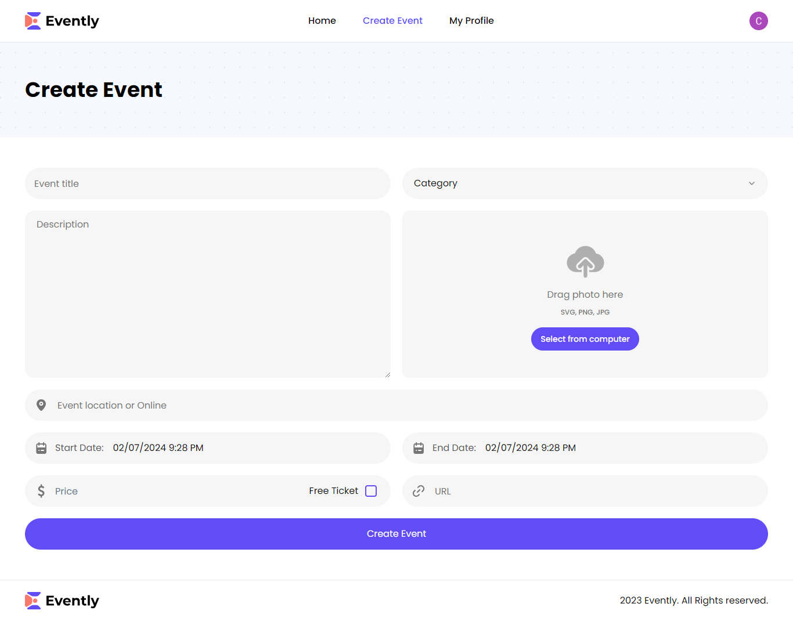

# study.Async

  Plataforma de Estudo Interativa para Diversas Áreas de Conhecimento

  
  
  

## Descrição do Projeto

O aplicativo "Study Async" é uma plataforma de perguntas e respostas que permite aos usuários criar e responder perguntas em várias categorias, como Python, JavaScript, etc., com diferentes níveis de dificuldade. Os usuários podem se cadastrar para acessar todas as funcionalidades, incluindo a criação de perguntas, respostas e acompanhamento do seu desempenho.

## Como Executar

1. Clone o repositório: `git clone git@github.com:matheusrodrigues1/study.Async.git`
2. Entre na pasta raiz do projeto: `cd study.Async`
3. Ative o 'venv': `venv\Scripts\Activate`
4. Rode o servidor: `python manage.py runserver`

## Autor

✉️: [Email](carlostech873@gmail.com) 
📄: [Currículo](https://drive.google.com/file/d/1Jfn9RAqFR3YaQbL8j_lJA0z8HHlLI3Xq/view?pli=1) 
💼: [Linkedin](https://www.linkedin.com/in/matheus-rodrigues-1a1899231/) 
📸: [Instagram](https://www.instagram.com/math.eusrrodrigues/)
